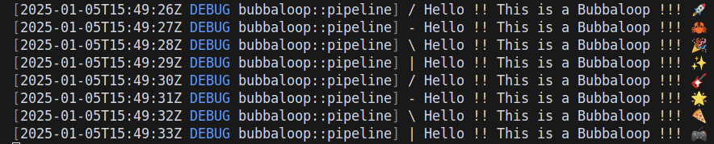

# 📷 Camera Recording

## Start recorder pipeline

Start recording from Webcams or RTSP[^1] cameras and log using [rerun.io](https://www.rerun.io).

```
just pipeline-start 0.0.0.0 3000 recording
```


this will generate a `rrd` file with the date and time as file name to the home of your project.


## Stop the recorder

To stop the pipeline, use the `pipeline-stop` command:

```
just pipeline-stop 0.0.0.0 3000 recording
```

## Visualize the streaming

You can open rerun in your local machine and you should get the image stream

<figure><figcaption></figcaption></figure>

## Get the logged data

You can go to your home directory (or via ssh) copy the logged files into your computer.

```bash
scp bubbaloop777:/home/nvidia/1735941642.rrd ~/data
```

Open back with rerun to introspect the recording

```bash
rerun 1735941642.rrd
```

[^1]: powered by [kornia-rs](https://github.com/kornia/kornia-rs) and [gstreamer-rs](https://gitlab.freedesktop.org/gstreamer/gstreamer-rs)
