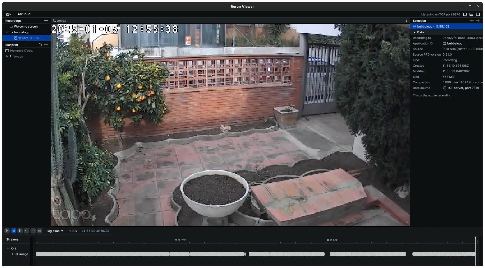

# 📷 Camera Recording

## Edit the pipeline file

Copper requires the creation of static pipelines to optimize data orchestration efficiently. Bubbaloop leverages this approach to enhance data pipeline management.&#x20;

For this reason we have to edit the `bubbaloop.ron` file located in the root of the GitHub project.



```json
(
    tasks: [
        (
            id: "cam0",
            type: "crate::cu29::tasks::V4L2Camera",
            config: {
                "camera_id": 0,
                "res_rows": 480,
                "res_cols": 640,
                "fps": 30,
            }
        ),
        (
            id: "rerun",
            type: "crate::cu29::tasks::RerunLogger",
            config: {
                // Path to the directory where the logs will be stored
                "path": "/tmp/",
                // IP address of the rerun server
                "ip": "192.168.1.144",
                // Port of the rerun server
                "port": 9876,
            }
        )
    ],
    cnx: [
        (src: "cam0", dst: "rerun", msg: "crate::cu29::msgs::ImageRGBU8Msg"),
    ]
    ,
    logging: (
        slab_size_mib: 1024, // Preallocates 1GiB of memory map file at a time
        section_size_mib: 100, // Preallocates 100MiB of memory map per section for the main logger.
    ),
)
```



```json
(
    tasks: [
        (
            id: "cam0",
            type: "crate::cu29::tasks::RTSPCamera",
            config: {
                // URL of the RTSP camera
                "url": "rtsp://<username>:<password>@<ip>:<port>/<stream>"
            }
        ),
        (
            id: "rerun",
            type: "crate::cu29::tasks::RerunLogger",
            config: {
                // Path to the directory where the logs will be stored
                "path": "/tmp/",
                // IP address of the rerun server
                "ip": "192.168.1.144",
                // Port of the rerun server
                "port": 9876,
            }
        )
    ],
    cnx: [
        (src: "cam0", dst: "rerun", msg: "crate::cu29::msgs::ImageRGBU8Msg"),
    ]
    ,
    logging: (
        slab_size_mib: 1024, // Preallocates 1GiB of memory map file at a time
        section_size_mib: 100, // Preallocates 100MiB of memory map per section for the main logger.
    ),
)
```



Then start server as usual `just server`

## Request start recording

Start recording from the camera and log using [rerun.io](https://www.rerun.io).

```
just pipeline-start 0.0.0.0 3000 recording
```


this will generate a `rrd` file with the date and time as file name to the home of your project.


## Visualize the streaming

You can open rerun in your local machine and you should get the image stream

<figure><figcaption></figcaption></figure>

## Request Stop recording

To stop the pipeline, use the `pipeline-stop` command:

```
just pipeline-stop 0.0.0.0 3000 recording
```

## Get the logged data

You can go to your home directory (or via ssh) copy the logged files into your computer.

```bash
scp bubbaloop777:/home/nvidia/1735941642.rrd ~/data
```

Open back with rerun to introspect the recording

```bash
rerun 1735941642.rrd
```
